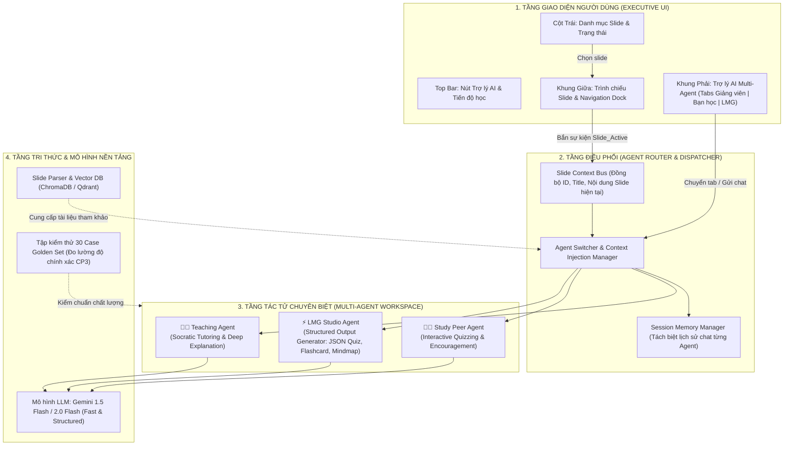

# Kiến Trúc Hệ Thống & Phương Hướng Lập Trình: Multi-Agent Learning Assistant

> **Dự án:** Mini Hackathon AI — Batch 04 · Lớp 3A (Phòng E403)  
> **Track:** C · Lesson Studio & Học tập thích ứng  
> **Phong cách thiết kế:** Executive Design System (Clean White Surfaces, Deep Slate Actions, Pill-shaped Controls)  
> **Tài liệu nộp mốc:** Checkpoint CP2 (Luồng hoạt động tương tác) & Chuẩn bị mốc CP3 (Prototype & Số đo)

---

## 1. Đặt Vấn Đề & Lát Cắt Sản Phẩm (Problem & Solution Slice)

### 1.1. Nỗi đau thực tế của người học (Real Pain Point)
Từ việc phân tích chatlog khóa học (`vlearn-pack`) và thảo luận cộng đồng (`discord-pack`):
1. **Học thụ động, dễ nản:** Khi đọc tài liệu slide nhiều chữ, học viên thường chỉ lướt qua mà không nắm được bản chất, không có ai đồng hành đặt câu hỏi để kiểm tra xem mình đã hiểu đúng chưa.
2. **Thiếu phản xạ kiểm tra nhanh:** Khi muốn ôn tập, học viên mất rất nhiều thời gian tự soạn câu hỏi trắc nghiệm hoặc tóm tắt lại ý chính.
3. **Một Chatbot đơn lẻ không đáp ứng trọn vẹn:** Nếu một bot vừa phải giảng giải bài, vừa phải đố vui, vừa phải sinh tài liệu thì ngữ cảnh rất dễ bị loãng, phong thái trả lời thiếu nhất quán và dễ sinh ảo giác (hallucination).

### 1.2. Giải pháp: Hệ Thống Đa Tác Tử Tương Tác Cùng Slide
Tích hợp một **Trợ lý AI Đa Tác tử (Multi-Agent Assistant)** ngay trong không gian bài học LMS, tự động bám sát slide đang mở và chia làm 3 vai trò chuyên biệt:
- 👨‍🏫 **Giảng viên (Teaching Agent):** Cắt nghĩa chuyên sâu, giảng giải khái niệm và chủ động hỏi gợi mở tư duy (Socratic method).
- 🧑‍🎓 **Bạn học (Study Peer Agent):** Đóng vai bạn cùng tiến, liên tục thách thức, đố vui ôn tập kiến thức slide để người học trả lời.
- ⚡ **LMG (Learning Material Generator):** Bộ máy tự động trích xuất nội dung slide để tạo ngay Quiz trắc nghiệm, Flashcard lật 2 mặt, Sơ đồ tư duy Mindmap và Tóm tắt trọng tâm.

---

## 2. Sơ Đồ Kiến Trúc Tổng Thể (System Architecture)

Hệ thống được thiết kế theo mô hình 4 tầng phân tách rõ ràng trách nhiệm:



---

## 3. Thiết Kế Chi Tiết Từng Agent & Kỹ Thuật Prompt

### 3.1. Giảng Viên AI (Teaching Agent)
- **Mục tiêu:** Giúp người học hiểu sâu lý thuyết, nắm được "Tại sao cần làm điều này?".
- **Phong thái:** Uyên bác, ân cần, giải thích khúc chiết, có tính sư phạm cao.
- **System Prompt mẫu:**
```text
Bạn là Giảng viên AI cao cấp tại khóa học Mini Hackathon AI.
Nhiệm vụ của bạn là giải thích chi tiết, sáng tỏ các khái niệm trong Slide được cung cấp.
RÀNG BUỘC CHẶT CHẼ:
1. Chỉ dựa trên nội dung Slide đang ghim: {CURRENT_SLIDE_CONTEXT}.
2. Nếu câu hỏi của học viên vượt ngoài phạm vi bài học, hãy khéo léo giải thích ngắn gọn rồi dẫn dắt quay lại bài giảng.
3. Luôn kết thúc câu trả lời bằng 1 câu hỏi gợi mở đào sâu (Socratic Question) để kích thích tư duy phản biện của học viên.
```

### 3.2. Bạn Học AI (Study Peer Agent)
- **Mục tiêu:** Tạo môi trường học tập hào hứng, cùng tiến bộ, đố vui để kiểm tra mức độ ghi nhớ.
- **Phong thái:** Trẻ trung, nhiệt tình, dùng đại từ xưng hô thân mật ("mình - bạn/cậu"), tích cực động viên.
- **System Prompt mẫu:**
```text
Bạn là một người bạn học cùng nhóm rất nhiệt tình, thông minh trong lớp Hackathon AI.
Nhiệm vụ của bạn là cùng học viên luyện tập nội dung tại Slide: {CURRENT_SLIDE_CONTEXT}.
QUY TẮC TƯƠNG TÁC:
1. Không thuyết giảng dài dòng như giáo viên; hãy đưa ra các câu đố nhanh, trắc nghiệm 3 phương án A-B-C hoặc câu hỏi tình huống thực tế.
2. Khi học viên trả lời đúng: Hãy chúc mừng nhiệt liệt và nâng độ khó câu hỏi tiếp theo!
3. Khi học viên trả lời sai: Động viên, gợi ý manh mối để học viên tự tìm ra đáp án đúng.
```

### 3.3. LMG (Learning Material Generator)
- **Mục tiêu:** Tự động kết xuất kiến thức slide thành các thành phần UI tương tác (Interactive Cards) tuân theo định dạng dữ liệu có cấu trúc (Structured JSON Schema).
- **Các loại tài liệu sinh ra:**
  1. **Interactive Quiz:** Câu hỏi trắc nghiệm 3-4 đáp án, xác định đáp án đúng và lời giải chi tiết.
  2. **Smart Flashcard:** Thẻ ghi nhớ 2 mặt (Mặt trước: Khái niệm / Câu hỏi cốt lõi; Mặt sau: Định nghĩa ngắn gọn & ví dụ).
  3. **Hierarchical Mindmap:** Cấu trúc cây (Root Node -> Branches -> Leaf Details) biểu diễn logic bài học.
  4. **Executive Summary:** 3 gạch đầu dòng then chốt của bài giảng.
- **JSON Output Schema cho Quiz:**
```json
{
  "type": "quiz",
  "slide_id": 3,
  "question": "Mục tiêu trọng tâm của việc thiết kế Multi-Agent trong slide là gì?",
  "options": [
    {"id": "A", "text": "Tăng số lượng dòng code của dự án", "is_correct": false},
    {"id": "B", "text": "Chuyên môn hóa vai trò tác tử và tối ưu trải nghiệm học tập", "is_correct": true},
    {"id": "C", "text": "Loại bỏ hoàn toàn vai trò của người dạy", "is_correct": false}
  ],
  "explanation": "Việc tách biệt Giảng viên, Bạn học và LMG giúp chuyên biệt hóa System Prompt và giảm thiểu loãng ngữ cảnh (token pollution)."
}
```

---

## 4. Cơ Chế Đồng Bộ Ngữ Cảnh & UX Flow (Context Sync & UX)

1. **Slide-Aware Context Pinning:**
   - Khi người học bấm chọn Slide bất kỳ ở Cột Trái hoặc bấm `Slide trước / sau` ở Dock dưới:
   - State `currentSlideIndex` thay đổi -> Trình chiếu cập nhật nội dung tương ứng.
   - Một sự kiện `CONTEXT_SYNC` được bắn tới Khung Trợ lý AI -> Thẻ ghim ngữ cảnh trên Header chat cập nhật ngay: `📌 Đang ghim ngữ cảnh: Slide X · [Tên bài]`.
   - Các câu lệnh tiếp theo được gửi tới Agent sẽ tự động mang theo metadata của slide hiện hành.

2. **Cơ Chế Dynamic Intro Dismissal (Yêu cầu quan trọng):**
   - Khi chuyển sang một Agent mới, hệ thống hiển thị một **Intro Banner** giải thích rõ vai trò và nhiệm vụ của Agent đó cùng các gợi ý prompt nhanh.
   - **Ngay khi người dùng gõ phím Enter gửi tin nhắn, click vào prompt gợi ý, hoặc chọn công cụ sinh tài liệu LMG**, Intro Banner sẽ lập tức ẩn đi một cách mượt mà để nhường toàn bộ không gian cho dòng hội thoại và kết quả sinh.

3. **Bảo toàn Ngữ cảnh Độc lập (Independent Session Memory):**
   - Cuộc trò chuyện với Giảng viên không bị lẫn với câu đố của Bạn học. Mỗi Agent có một mảng lịch sử `chatHistories[agentId]` riêng biệt, cho phép người học quay lại tiếp tục mạch tư duy với từng tác tử bất cứ lúc nào.

---

## 5. Phương Hướng Lập Trình & Tech Stack Khuyến Nghị

### 5.1. Tầng Frontend (Client)
- **Giai đoạn Prototype (Hiện tại - CP2):** 
  - Vanilla HTML5 + CSS3 (Executive Design System) + Vanilla JS thuần túy.
  - **Ưu điểm:** Khởi chạy tức thì không cần cấu hình build phức tạp, chạy trực tiếp trên file tĩnh hoặc local server phục vụ kiểm thử và quay video demo mốc CP2 & CP3.
- **Giai đoạn Mở rộng (Production - Next.js):**
  - **Framework:** Next.js 14+ (App Router) hoặc React + Vite.
  - **Styling:** TailwindCSS cấu hình theo bảng màu Executive (`slate-900`, `slate-100`, soft tints) kết hợp Framer Motion cho các hoạt cảnh chuyển tab và trượt drawer.
  - **Components:** Radix UI / Shadcn UI cho các thành phần Accessible Drawer, Dialog và Tooltips.

### 5.2. Tầng Backend & Agent Orchestration (Server)
- **Ngôn ngữ & Framework:** Python 3.11+ kết hợp **FastAPI**.
  - Xử lý bất đồng bộ (Asynchronous async/await) cho phép nhiều luồng hỏi đáp đồng thời.
  - Hỗ trợ giao thức **Server-Sent Events (SSE)** hoặc **WebSocket** để stream từng token câu trả lời từ AI về giao diện (tạo cảm giác AI đang gõ chữ thời gian thực).
- **Framework Quản lý Đa Tác tử:**
  - **Google Antigravity SDK** hoặc **LangGraph (LangChain)**.
  - Cho phép định nghĩa đồ thị trạng thái (State Graph), trong đó mỗi Agent là một Node, Router là cạnh rẽ nhánh (Conditional Edge) dựa trên ý định người học.
- **Mô hình LLM:**
  - Khuyến nghị sử dụng **Gemini 1.5 Flash** hoặc **Gemini 2.0 Flash**: Tốc độ xử lý cực nhanh (< 1.5s), hỗ trợ Structured JSON Outputs hoàn hảo cho LMG, chi phí token tối ưu và cửa sổ ngữ cảnh đủ lớn để nạp toàn bộ giáo trình.
- **Cơ sở dữ liệu Vector (Vector DB):**
  - Sử dụng **ChromaDB** hoặc **Qdrant** (chạy embedded hoặc Docker) để lưu trữ embedding của từng slide và phần chú thích bài giảng.

---

## 6. Lộ Trình Triển Khai Cho 6 Mốc Hackathon (Checkpoint Roadmap)

| Mốc | Hạn chót | Nhiệm vụ hoàn thành | Bằng chứng nghiệm thu |
|---|---|---|---|
| **CP1** | 19:30 · 16/9 | Chốt Canvas 4 ô + Repo GitHub + Khai 2 willing users | Link repo public, README cập nhật |
| **CP2** *(Hiện tại)* | **21:00 · 16/9** | **UI Mock tương tác bấm thử được** (Slide viewer + 3 Agent + LMG Studio) | File `index.html`, `styles.css`, `app.js` mở xem ngay luồng hoạt động |
| **CP3** | 16:00 · 17/9 | Prototype AI thật + Đo lường định lượng trên 30 ca golden set | Video quay màn hình 30s + Bảng số đo tỉ lệ chính xác (> 85%) |
| **CP4** | 21:00 · 17/9 | Hoàn thiện tài liệu `ai-spec.md`, khóa chuẩn "Đạt", khai điểm chưa xong | File `spec.md` hoàn chỉnh theo rubric |
| **CP5** | 13:00 · 18/9 | Slide thuyết trình PDF + Video demo dự phòng + Kết quả thử nghiệm người dùng | Bộ tài liệu pitch & feedback từ 2 willing users |
| **CP6** | 17:30 · 18/9 | Vòng thi thuyết trình chung cuộc tại phòng E403 | Demo trực tiếp sản phẩm |

---

## 7. Hướng Dẫn Mở & Trải Nghiệm Bản Mock Tại Chỗ

Bạn có thể chạy thử nghiệm giao diện ngay lập tức bằng một trong hai cách:
1. **Cách 1 (Mở trực tiếp file):** Mở tệp `index.html` trong trình duyệt bất kỳ (Chrome, Safari, Edge).
2. **Cách 2 (Chạy local dev server):**
```bash
# Sử dụng Python HTTP server tích hợp sẵn:
python3 -m http.server 3000
# Sau đó truy cập: http://localhost:3000
```

Bản mock đã có đầy đủ:
- Bấm nút **Trợ lý AI (Multi-Agent)** trên top bar để đóng/mở drawer.
- Bấm chuyển đổi giữa 3 tác tử: **Giảng viên**, **Bạn học**, và **LMG Studio**.
- Bấm chọn các prompt gợi ý hoặc gõ tin nhắn để kiểm chứng việc **Đoạn giới thiệu tự động ẩn đi**.
- Bấm vào các công cụ trong LMG để trải nghiệm **Quiz tương tác có chấm điểm tức thì**, **Flashcard 3D lật 2 mặt**, **Sơ đồ tư duy**, và **Tóm tắt bài học**.
- Bấm chọn các slide ở cột trái hoặc nút `Slide trước / sau` để kiểm tra việc **Đồng bộ ngữ cảnh thời gian thực**.
